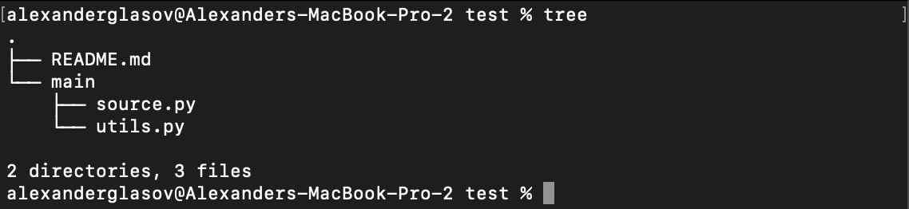
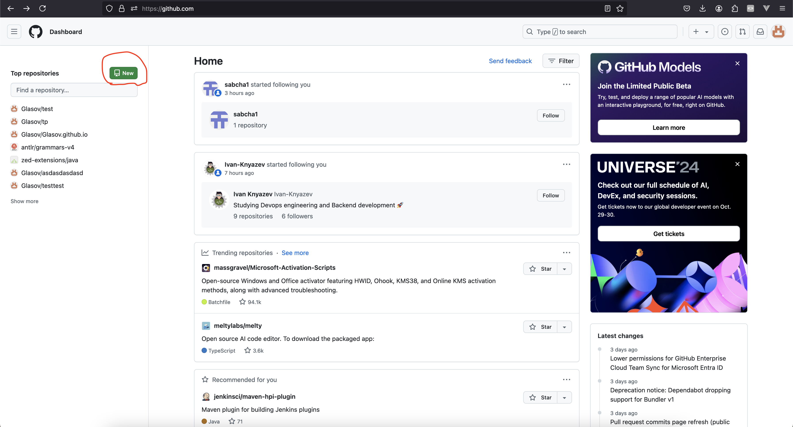

# Лаба 1 - Git

На лекции о гите мы узнали немного о том, как он работает изнутри, в этой лабе научимся им пользоваться.

Git представляет из себя утилиту для командной строки, которая называется `git`

# Что нужно сделать

1. Создать репозиторий
2. Сделать коммит
3. Добавить удалённый репозиторий
4. Запушить локальные коммиты в удалённый репозиторий

# Содержание

## Установка

На линукс гит изначально должен быть установлен, но если у вас другая операционная система или его нет по какой-нибудь причине, нужно его установить.

Гайд по установке: [https://git-scm.com/downloads](https://git-scm.com/downloads)

## Работа с гитом

Работать с гитом будет в проекте со следующей структурой:

Структура проекта

Для инициализации репозитория нужно воспользоваться командой `git init` , которая создаст в текущей директории гит-репозиторий (скрытую папку .git с базой данных и метаданными)

Инициализация репозитория git

Теперь посмотрим, какой статус имеет каждый файл в проекте. Так как мы пока не добавляли файлы в индекс и не коммитили, их статус будет edited

Для этого выполним команду `git status`

Результат выполнения команды git status

Супер, теперь добавим все файлы проекта в индекс, чтобы они были добавлены в будущий коммит, это делаем при помощи команды `git add .` (точка в конце указывает, что нужно добавить все файлы)

Результат выполнения команды git add . - все изменённые файлы были добавлены в индекс

Перед тем, как коммитить добавим информацию о себе: имя и почту. Это полезно в реальных проектах, потому что сразу видно и понятно, кто какие изменения делал. Для этого существует команда `git config` 

Добавляем информацию о себе

Создадим коммит: для этого используем команду `git commit` 

Создание первого коммита

Посмотрим историю коммитов в репозитории при помощи комманды `git log` 

История коммитов в репозитории

Создадим удалённый репозиторий на github

Создаём репозиторий в гитхабе

Теперь надо настроить репозиторий, чтобы можно было выполнять команду `git push`  - отправлять локальные коммиты в удалённый репозиторий

Сперва нужно добавить ssh-ключ в гитхаб. Здесь написано, как это сделать: https://docs.github.com/en/authentication/connecting-to-github-with-ssh/generating-a-new-ssh-key-and-adding-it-to-the-ssh-agent

Дальше нужно добавить в локальный репозиторий данные об удалённом репозитории при помощи команды `git remove` 

Добавляем удалённый репозиторий

Теперь можем наконец-то пушить! Это сделаем командой `git push` 

Пуш в удалённый репозиторий

Ну вот и всё! Теперь вы умеете использовать базовые команды гита!

Результат пуша - теперь ноши локальные изменения есть на сервере, в удалённом репозиторие

Ссылка на проект, если нужна: https://github.com/Glasov/my-first-repo
