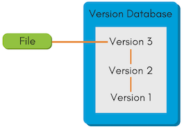

# Git

# Системы контроля версий *

Система контроля версий (VCS) — это система, записывающая изменения в файл или набор файлов в течение времени и позволяющая вернуться позже к определённой версии.

Обычно git используется в проектах, связанных с разработкой ПО, но на самом деле его можно использовать для любого проекта: будь то 3d модели, фотографии и т.д.

VCS нужны для удобства переключения между состояниями проекта и совместной разработки.

Существует три основных типа VCS:

## Локальные VCS *

Все данные - файлы, сама история изменений и остальные хранятся локально на компьютере. Это самая простая система, где не нужны даже какие-либо инструменты: можно просто вести папку с архивами.

### Плюсы

- Это просто

### Минусы

- Это совсем не надёжно: если произойдёт сбой в работе компьютера, все изменения, сам проект, и все его версии будут утеряны.
- Не подходит для больших проектов, потому что необходимо вручную перекидывать файлы и архивы между разработчиками - это неудобно и долго.

Схема локальной VCS

## Централизованные VCS *

На локальном компьютере хранятся данные о файлах и версии, с которой ведётся работа на текущий момент. Все версии находятся в центральной базе данных или сервере - репозиторие -, откуда и куда уже отправляются эти данные.

### Плюсы

- Сокращает объём памяти, который хранится на пользовательских компьютерах
- Позволяет вести совместную разработку
- Легче контролировать ход работы над проектом

### Минусы

- Если сервер выйдет из строя - всё, работа встанет
- Если данные на сервере будут утеряны, весь проект с его версиями будут утеряны

Схема централизованной VCS

## Децентрализованные VCS *

В децентрализованных VCS файлы, версии и прочая информация хранится у всех участников этой системы. По-прежнему существует удалённый репозиторий (или даже несколько), на котором хранятся эти данные и куда отправляются изменения, но при выходе его из строя, у всех разработчиков будет полная история изменений и все файлы проекта - так, каждый пользователь имеет полный бекап всего проекта.

Git как раз является децентрализованной VCS

### Плюсы

- Больше упрощает параллельную разработку
- Если произойдёт сбой в удалённом репозиторие, данные не будут утеряны
- Даёт разработчику полный контроль над изменениями проекта
- Позволяет иметь сразу несколько удалённых репозиториев, что невозможно в централизованных VCS

### Минусы

- Требует большего объёма памяти у пользователя, чем в централизованных VCS

# История git

Git был создан в 2005-м году командой Линуса Торвальдса - создателем ядра Linux. Они преследовали несколько целей при создании этой VCS, среди которых:

- Скорость
- Простая архитектура
- Хорошая поддержка нелинейной разработки (тысячи параллельных веток)
- Полная децентрализация
- Возможность эффективного управления большими проектами, такими как
ядро Linux (скорость работы и разумное использование дискового
пространства)

 гита](./images/image%202.png)

Почему git называется git - из официального [README.md](http://README.md) гита

# Как работает Git *

Как правило, в системах до гита хранились только изменения файлов, гит ушёл от этого концепта и хранит “снимки” состояния проекта на определённый момент.

Каждый раз, когда вы делаете коммит, то есть сохраняете состояние своего проекта в Git, система запоминает, как выглядит каждый файл в этот момент, и сохраняет ссылку на этот снимок. Для увеличения эффективности, если файлы не были изменены, Git не запоминает эти файлы вновь, а только создаёт ссылку на предыдущую версию идентичного файла, который уже сохранён.

Git представляет свои данные как, скажем, **поток снимков**.

Почти все операции в git выполняются локально на компьютере. Это позволяет не завязываться на удалённых репозиториях, повышает независимость процесса разработки от серверов и ускоряет работу над проектом.

У гита есть три основных состояния для файлов проекта:

1. Изменён - файлы, которые поменялись, но ещё не были зафиксированы
2. Индексирован - это изменённый файл в его текущей версии, отмеченный для включения в следующий коммит
3. Зафиксирован - файл уже сохранён в вашей локальной базе

Эти состояния соответствуют трём важным частям гита:

1. Рабочей директории - рабочей копии
2. Области индексирования
3. Каталогу Git

Рабочая копия является снимком одной версии проекта. Эти файлы извлекаются из сжатой базы данных в каталоге Git и помещаются  на диск, для того чтобы их можно было использовать или редактировать.

Область индексирования — это файл, обычно находящийся в каталоге Git, в нём содержится информация о том, что попадёт в следующий коммит. Её техническое название на языке Git — «индекс»

Каталог Git — это то место, где Git хранит метаданные и базу объектов вашего проекта.
Это самая важная часть Git и это та часть, которая копируется при *клонировании* репозитория с другого компьютера. Базовый подход в работе с Git выглядит так:

1. Изменяете файлы вашей рабочей копии.
2. Выборочно добавляете в индекс только те изменения, которые должны попасть в следующий коммит, добавляя тем самым снимки *только* этих изменений в индекс.
3. Когда вы делаете коммит, используются файлы из индекса как есть, и этот снимок сохраняется в ваш каталог Git.

Если определённая версия файла есть в каталоге Git, эта версия считается *зафиксированной* (committed).

Если файл был изменён и добавлен в индекс, значит, он *индексирован* (staged).

И если файл был изменён с момента последнего распаковывания из репозитория, но не был добавлен в индекс, он считается *изменённым* (modified).

## База данных Git *

Каталог Git представляет из себя директорию `.git` , где хранится база данных с объектами и метаданными. База данных хранит объекты по уникальному ключу, который представляет из себя строку из 40 символов в 16-ричной системе (символы “1234567890abcdef”) - например: `306cfcf662433485f71e38d9c234cc33213dbe69`

Каждый ключ весит 20 байт

В качестве объектов может быть несколько сущностей:

**Blob** (**b**inary **l**arge **ob**ject) - сущность, соответствующая файлу в файловой системе. Ключ является хешом содержания файла, поэтому для любых двух одинаковых файлов (даже с разным названием или в разных коммитах) ключи будут тоже одинаковые. Это позволяет не хранить лишнюю информацию, дубли.

**Tree** (дерево) - сущность, соответствующая директории в файловой системе. Для каждого коммита хранится дерево корневой директории проекта, его поддеревьев и блобов. В отличие от блобов, деревья хранят информацию о пути файлов и директорий. Получается структура, похожая на файловую систему. Деревья создаются для любого нового коммита, независимо от того, были ли изменения в структуре проекта. Сами деревья не хранят и не создают физические директории, они являются просто репрезентацией фалов проекта.

Tree (дерево) в Git

**Commit** (коммит) - сущности, хранящие информацию о коммитах. В них входят информация об авторе коммита, времени коммита, ссылка на дерево корня проекта и другая метаинформация.

## Ссылки в Git *

В гит существует несколько видов ссылок на коммиты, называемые refs (references). Они хранят SHA-1 сущности коммита (его ключ в базе данных git).

Основные типы ссылок в Git включают:

1. **Ветки (Branches)**:
    - Ветки — это подвижные ссылки, которые указывают на последний коммит в цепочке коммитов. Когда вы создаете новый коммит в ветке, ссылка на
    ветку автоматически обновляется, чтобы указывать на этот новый коммит.
    - Примеры: `main`, `develop`, `feature/new-feature`.
2. **Теги (Tags)**:
    - Теги — это неподвижные ссылки, которые указывают на конкретный
    коммит. Они используются для пометки важных моментов в истории проекта,
    таких как релизы.
    - Примеры: `v1.0.0`, `release-2023-10-01`.
3. **HEAD**:
    - `HEAD` — это специальная
    ссылка, которая указывает на текущую ветку или коммит, на котором вы
    находитесь. Она позволяет Git знать, где вы находитесь в истории
    проекта.
    - Пример: `HEAD` может указывать на `main` или на конкретный коммит.

Ссылки в Git хранятся в специальных файлах и директориях внутри репозитория, таких как `.git/refs/` и `.git/packed-refs`. Они позволяют Git эффективно управлять историей проекта и предоставляют удобный способ работы с коммитами.
